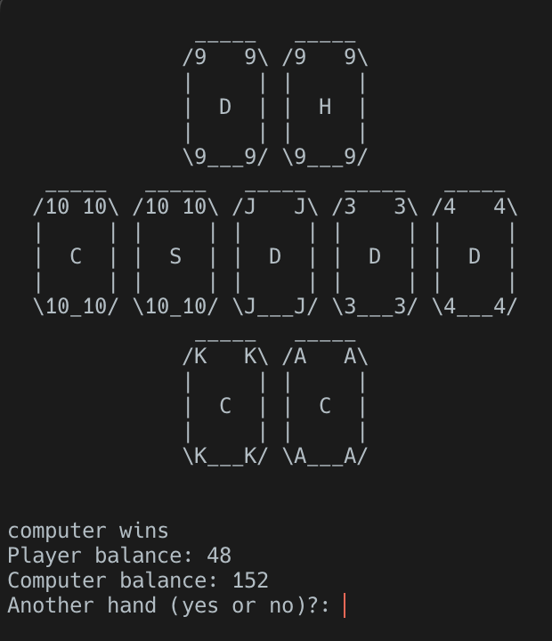

# Command Line Poker
## Clp is a Graphical Command Line Poker Game Against the Computer
This is a project written entrirely in c as a fun command line game that allows you get a few hands of poker in between pull requests. There are command line graphics for displaying the state of the table, and imaginary $ to fret over. But what would poker be all by yourself. There is also a computer opponent that uses probability to bet wisely. Give it a try!

## Download
Go to the [Latest Release](https://github.com/AlexanderPrentiss/CLPoker/releases/tag/v1.0.0).
Or you can compile the binaries yourself. Just make sure to change the makefile to use your native compiler(Win: gcc, Mac: clang, Linux: anything).
## How to run
Simply run the executable and the game will start up. You will be prompted after every round if you would like to quit, or you can just CTRL^C.
## How to play
The player always bets first so make a wise bet and then let the computer match, raise, or fold.
If the computer folds the player wins. If it raises the player is prompted to match or fold
In the next round the first three table cards (flop) are shown and another round of betting commences!
At the end of all betting rounds, if no one folded, the computers cards are reveild and a winner is decided!

## Enjoy!
